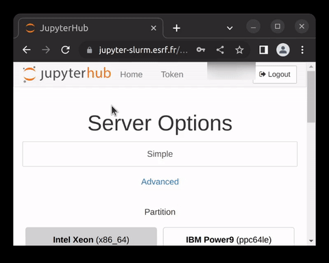
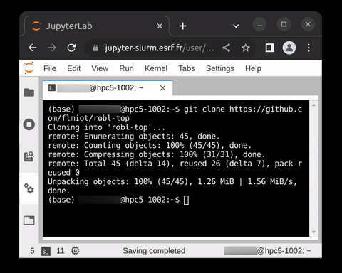

# robl-top
A collection of scripts for the TOP group at ROBL-II beamline, ESRF.

Run the notebooks in 1,2,3:

1.) Login to the ESRF JupyerLab instance:

2.) Make a copy of the Jupter notebooks in your home directory.

3.) To get started, adjust the parameters in the notebooks and run the required cells.

